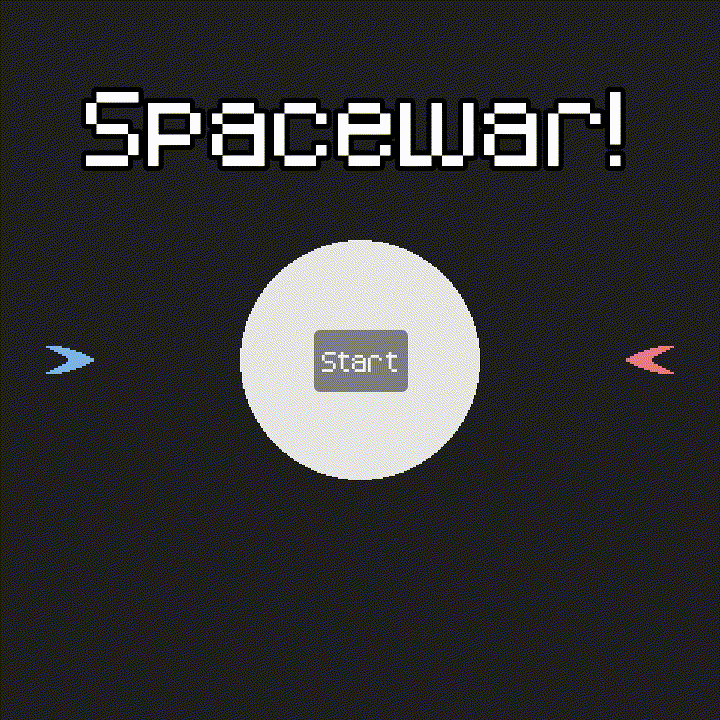

# Spacewar!

Challenge #4 of [The 20 Games Challenge](https://20_games_challenge.gitlab.io/). A remake of the 1962 classic — two ships, one star trying to kill you, and a friend on the same keyboard.

---

## Controls

| | Player 1 | Player 2 |
|---|---|---|
| Thrust | `W` | `Up Arrow` |
| Turn Left | `A` | `Left Arrow` |
| Turn Right | `D` | `Right Arrow` |
| Shoot | `Space` | `Right Enter` |

---

## Notes

The star in the middle has gravity, so you can't just sit still and aim. Bullets disappear when they leave the screen — keeps things readable. Ships screen wraps around on all edges using `wrapf` inside `_integrate_forces`. I see this from [Godot Recipes](https://kidscancode.org/godot_recipes/4.x/).

Added explosion particles on death using `CPUParticles2D` to add some juice.

This one introduced me to `RigidBody2D` which is a completely different beast compared to `CharacterBody2D`. Physics-based movement means you're fighting momentum constantly, which is kind of the whole point of the game. I used `constant_force` and `constant_torque` to apply thrust and rotation the standard approach for `RigidBody2D` since you don't control it directly.

Also built a global `SignalManager` and `SoundManager` as autoloads. Probably overkill for a game this small but good practice.

---

## Stack

Godot 4.6.1-stable / GDScript — sounds and font from [Kenney.nl](https://kenney.nl/)
